# Data vault course from Udemy

# Traditional modeling concepts

## ERD
- An ERD is a visual representation of different entitites within a system and how they relate to each other. 
- they explain logical structure of databases.

- ERDs contain entities (rectangles), attributes (ovals), and relationships (diamond).
- entities are basic entities of ERDs and you can think of them as nouns (studnets, projets, faculty, etc). they are converted to tables in database
- relationships are how entities interact with each other.

__attributes__: property or characteristic of entity. these become columns in the table for the entity.

### Types of attributes:
- primary key - uniquely identifies an entity. unique and never changing and never null.
    - first name is not a good primary and key and neither is the combo of first and last name because two people can have the same names. but email is a beter primary key.

- foreign key - referencing key used to link two tables together. It can replicate, can be null.

- relational diagrams can be imported into your database. 

### Data models
- way to organize data
- done during planning phase. business rules are converted to data structures. conversion of business to graphical relationships.
- can be divided into 3 catagories, with different levels of abstraction.

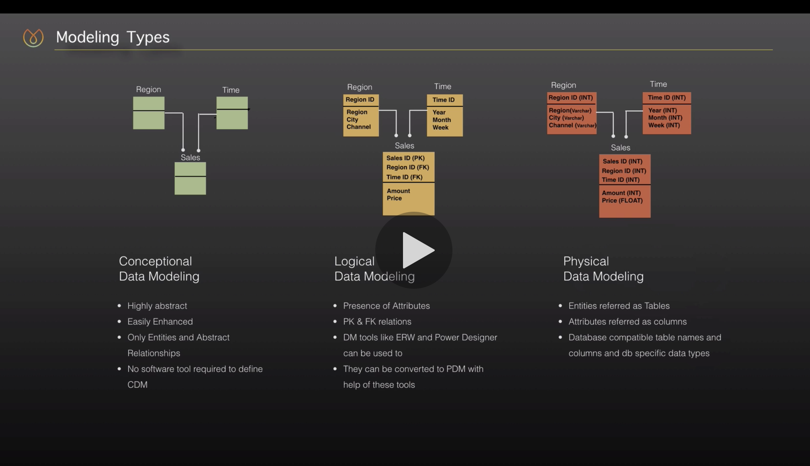

### DWH architecture
- the staging area sits in between source data (could be raw files) and the DWH. Why? We don't want to disrupt the source data databases by running complicated ETL so we copy data from source to staging. we don't want to discrupt operational systems.
- Staging layer might have a lot of different formats of the same data. etl merges this data into data warehouse so the DWH has a single point of truth and unified data. It has a unified structure. we transform to the expected structure before loading into data warehouse from source data that might be different structures. Single structure/standard format should exist in DWH.

### Data Normalization
- column cell cannot hold more than 1 value.

__1nf__: 
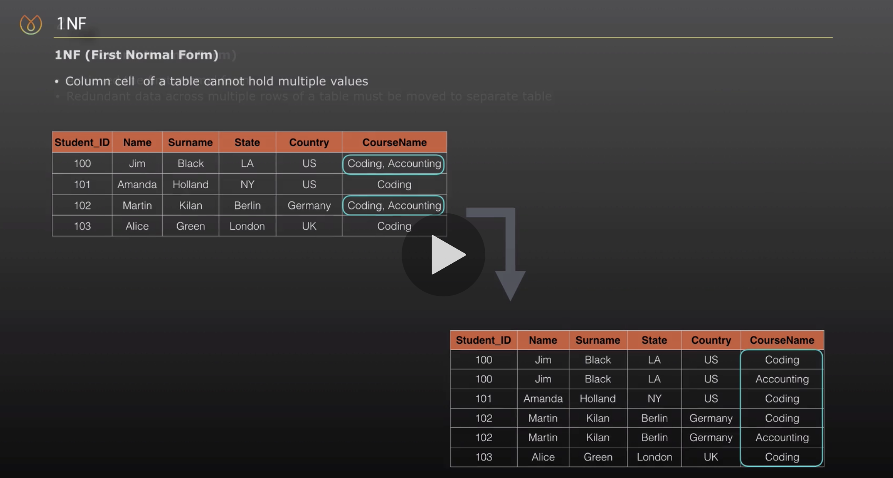

Still redundancy problems as you can see

__2nf__:
- in 1nf
- redundant data must be moved to a separate table
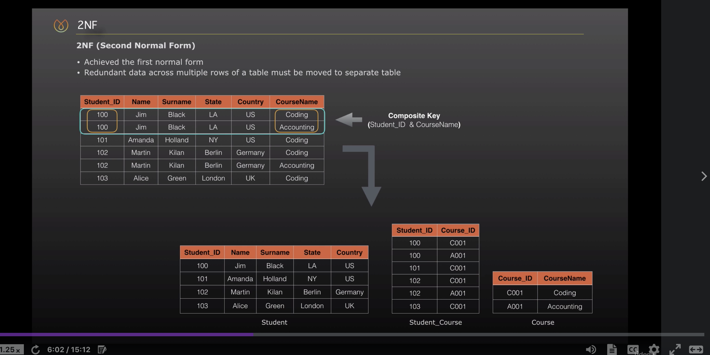
  

__3nf__:
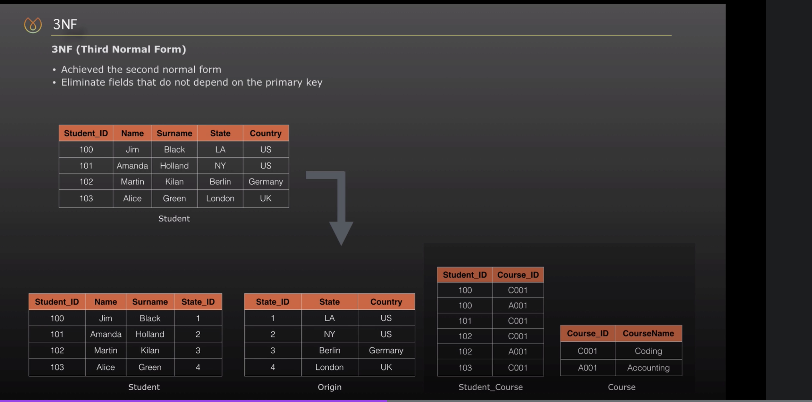

state column depends on country column and not the primary key. 
- state does not depend on primary key.
- transitive dependency: when a non-key column depends on another non-key column. we should separate these out to another table. 
- Here state and country change together. so we separate it out since state and country are not dependent on country column.

### Data Denormalizaton
- data from multiple tables are combined into 1
- can improve speed. Can avoid constant JOINS in relational database and improve performance. 
- it's an optimization technique AFTER applying normalization. it does not mean avoding normalization.
- it's not an alternative to normalization, denormalization is a technique to optimize queries.

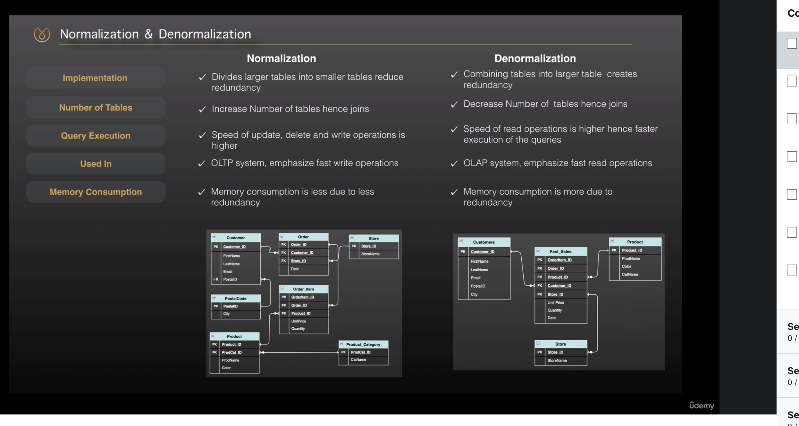

### Why is normalization important for OLTP systems?
- updates are fast because you only have to updat 1 row. 

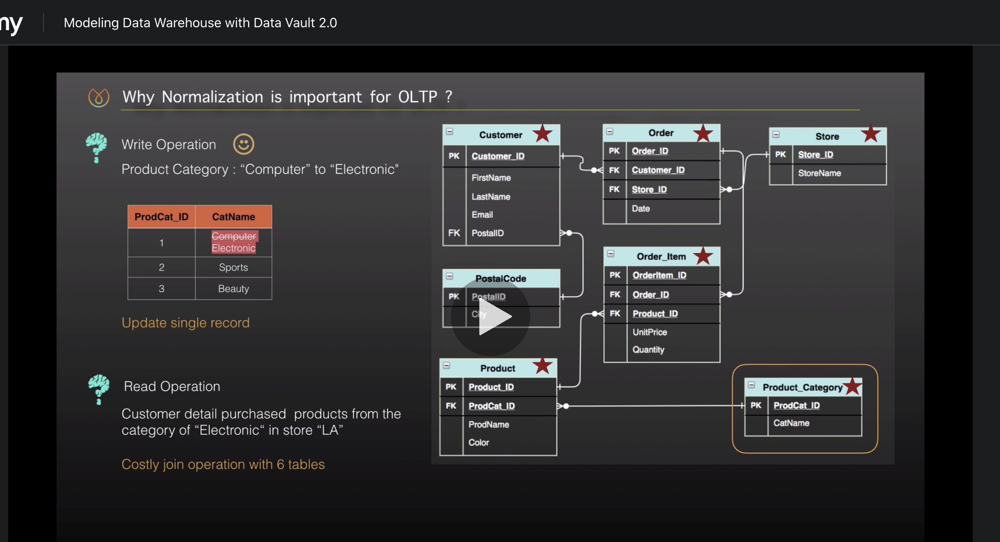

### Why is denorm important?
- updates have to update all rows in record. You can't miss 1 otherwise data inconsistency.
- but because data is combined into 1 place, reads are faster.

  
### Norm vs Denorm
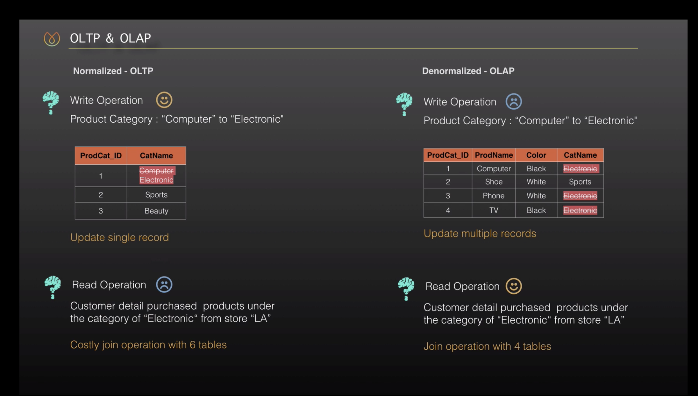

### Top down vs bottom up DWH design
- in top down, the DWH uses ER modeling (3nf) while data marts use dimensional modeling (star schema or snowflake). Remember ER modeling uses foreign keys to relate tables, attributes as columns, and entites as tables.
- in bottom up, the DWH uses dimensional modeling and the data marts use dimensional modeling.
concepts we need to know: er modeling, dimensional modeling, 3nf, 

**top down advantages**:
- DWH is single source of truth for enterprise.
- subsequent project cost is lower.
- there is  data consistency because the data marts pull from the datawarehouse. So if data changes in the DWH, all data marts that use that data will be updated.

**top down disadvantages**:
- initial setup takes time. the DWH is a large project
- the model becomes complex over time as it involves more tables and joins.

**bottom up advantages**:
- works well for department metrics
- focuses on creating user friendly data structures using star schemas in data marks
- delivers rapidly, less infra up front
- works well for dept wide metrics
- just need to create new data marts

**bottom up disadvantages**:
- no one source of truth. data is not fully integrated before serving reporting needs
- data redundant due to denormalized data model, have to update in multiple areas

### Dimensional modeling.
- remember that OLTP systems are meant for fast write and not suitable for reporting. they normally employ ER model with 3nf to avoid data redundancy problems
- DWH handle compelx queries
- DWH top down or bottom up

Why dimensional modeling?
- you can write SQL but that's complex for avg user.
- our objective is a DWH that is easy for analyst to write queries. main goal is for fast retrieval.
- utilize fact and dimension tables.

What are Fact Tables?:
- sales revenue
- amount
- quantity

Dimension Tables:
- context surrounding business process event. Gives who/what/where
- customer, location, product names, etc.
- a description about the facts
- oftne denormalized

Attributes:
- various characteristics of the dimensions. state, country, zip for location dimensions for example.
- used to search or filter or classify the facts.
- exist in both dimension and fact tables.

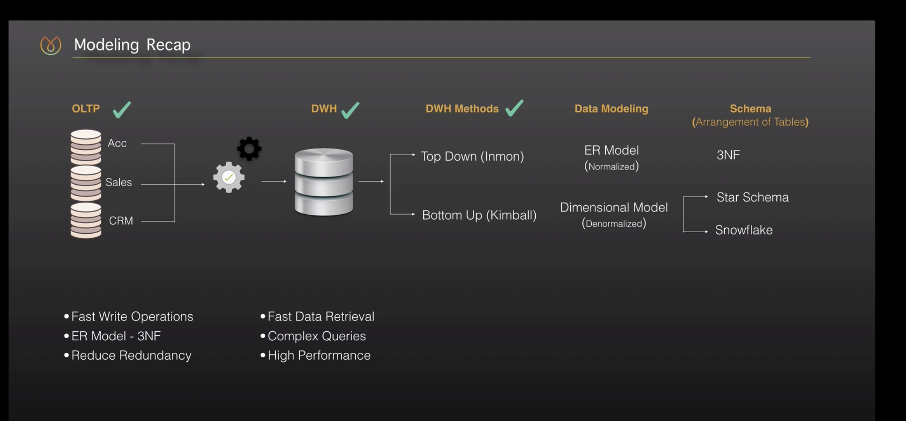

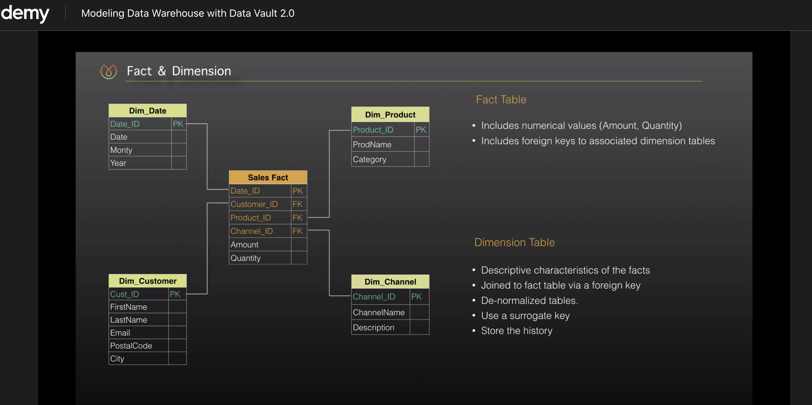

**dimension tables**:
- denormalized
- descriptive characteristics of the facts
- joined to fact table via foreign key

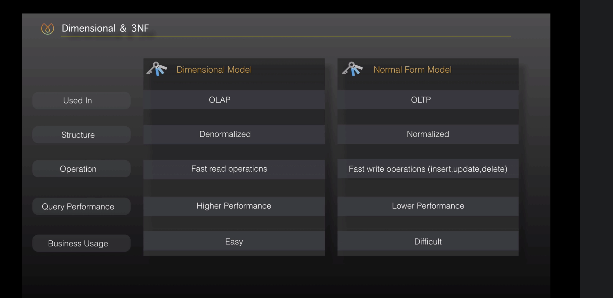

**why dimensional modeling**:
- easy to understand regardless of end user tech knowledge
- faster database performance
- fewer tables in dimension tables because denormalized so better performance
- used in OLAP and not OLTP more simplified structure so business users can write queries against it.
- whereas Normal Form and 3nd are used in OLTP for faster writes.

### Star Schema
- in dimensional model, there are 2 types of dimensional models
- star schema can have 1 fact table and a number of associated tables around it. it resembles a star, so it's called a star schema.
- dimension tables are NOT joined to each other and only have primary key field
- dimension tables are not normalized tables. So customer tables can have customer info and location info. Or Sales Channel table can have channel information and store information. Not normalized data. So this information is stored in a single table.
- star schema has easy to use structure

### Snowflake Table
- further normalization. For customer info will separate out customer and location info.
- as a result, dimension tables can have foreign keys.
- main benefit: snowflake uses smaller disk space due to less denormalized structure
- but due to multiple tables, query performance is less.

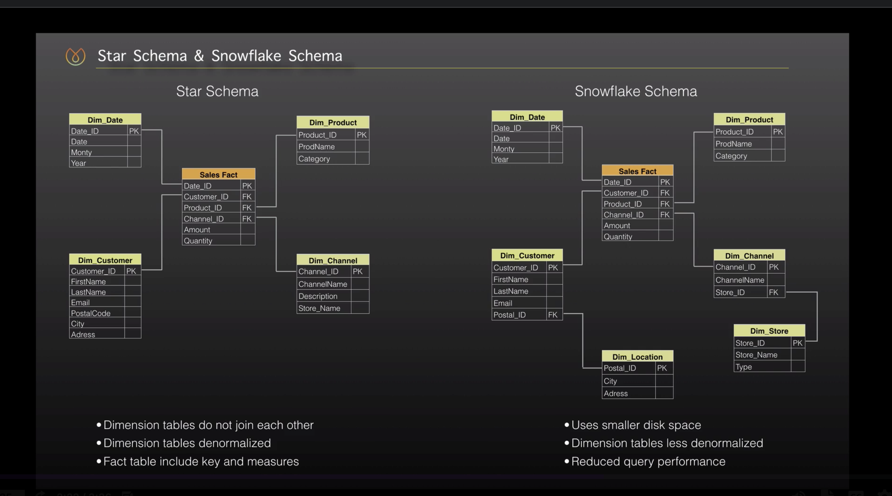
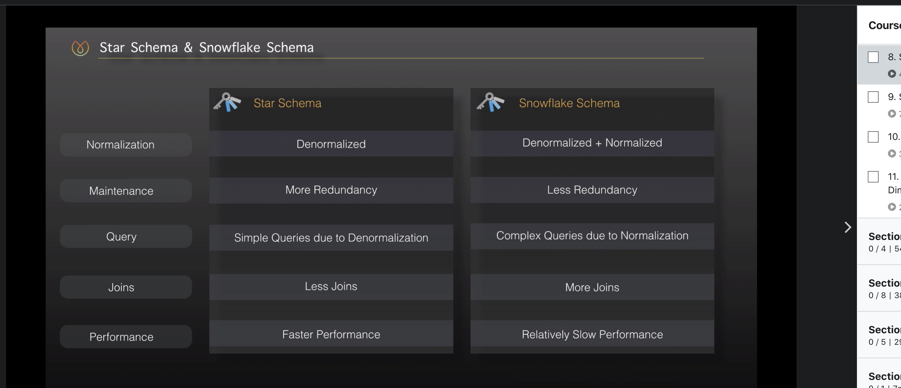

### Slowly changing Dimensions
- common technique use to capture changing data within the dimension

#### Type 1 corrections
- when you just correct the data but you lose historical data

#### Type 2 corrections
- add a new row to dimension table so history is kept.
- notice a current_Flag which makes queries easier in the reporting layer.
- updates might be expensive so it's recommended to use in tables where attributes are not added in the future, or not likely.

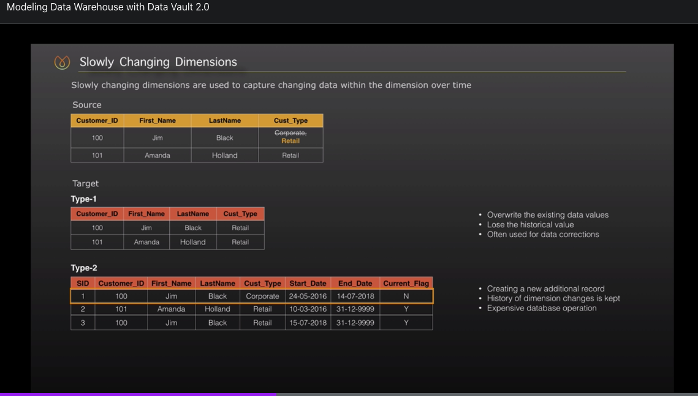

#### Surrogate keys
- it is a sequential generated numbers by the relational system and you use it when you cannot use the primary key because it's no longer unique.
- use in dimension tables where we need to track historical values
- if you keep multiple versions of a row, the primary key like customer_id no longer would be unique so we need a surrogate key.

### ER diagram to Relational model and then to Dimensional Model
This is an exercise
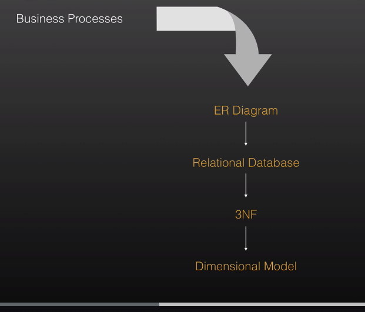

Step 1 of ER Diagram is to setup entities.
ideate:
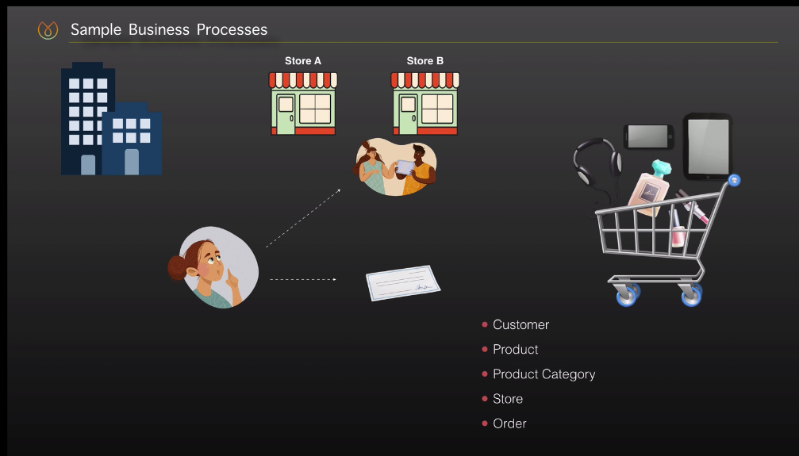

then make ER diagram:
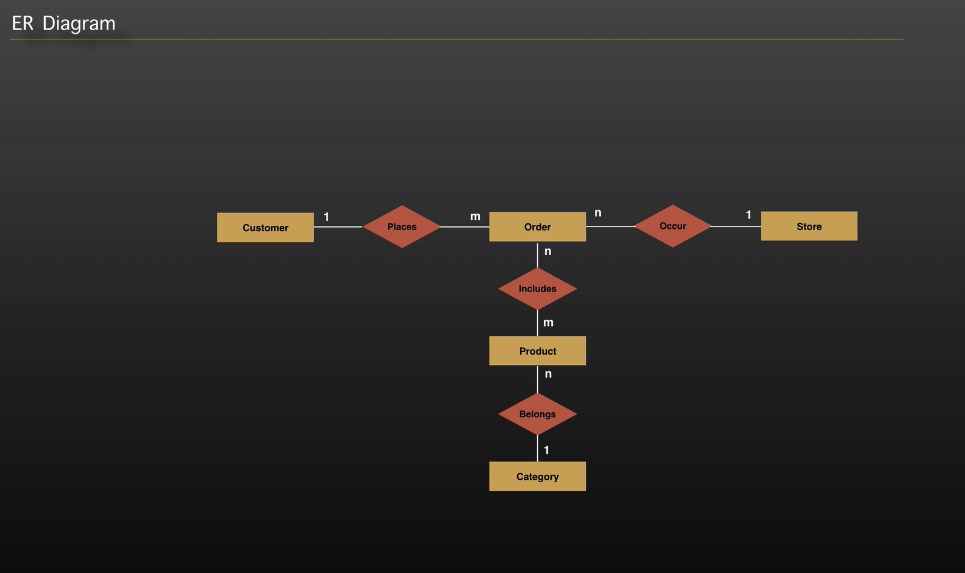
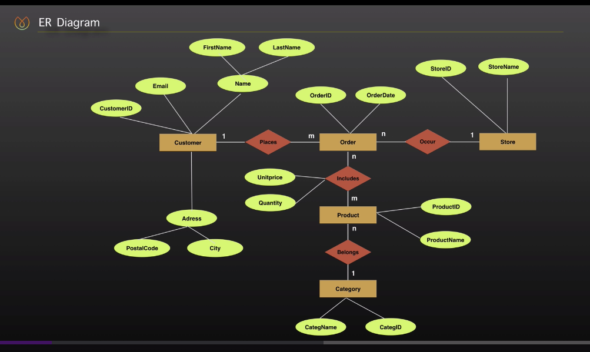

Some description of above:
- 1 to many relationship between customer and order
- 1 to many relationship between store and order
- many to many relationship between product and order
- many to many relationship between product and category

- What is a composite key: primary key composed of multiple columns to identify each record uniquely. Often used in mult-mult relationships like OrderProducts where there are 2 foreign keys we can use as a primary key. But in here, we don't do that and just create a unique primary key in the OrderDetail (joined table between Order and PRoduct) instead of using a composite key.

This is the relational model:
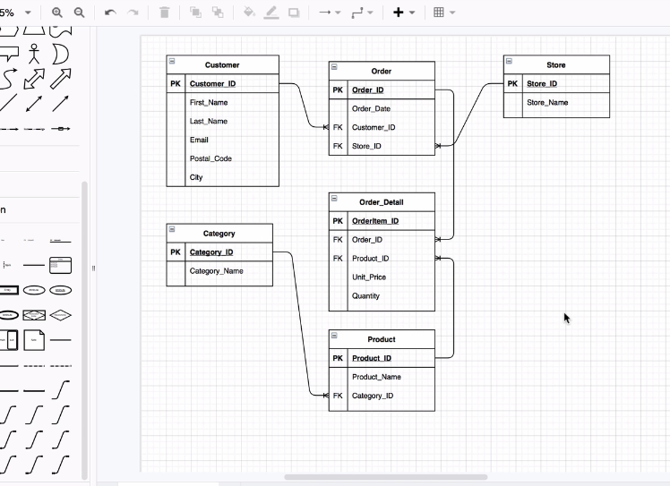

Remember to reduce redunancy, we need to change to 3rd normal form:
- REmember 1NF cannot have multiple values in a column. 
- in 2NF, it's 1NF but it redundant data across multiple rows are moved into separate tables.
- in 3NF, columns that do not depend on primary key are moved.

for 3NF, for stores, they have store names which are unqiue so they change with primary keys. so store_names stay in the store table. But say city information in the Customer table does not. City dpeends on say Postal_Code. City does not depend on the primary key so it needs to be separated to another table.

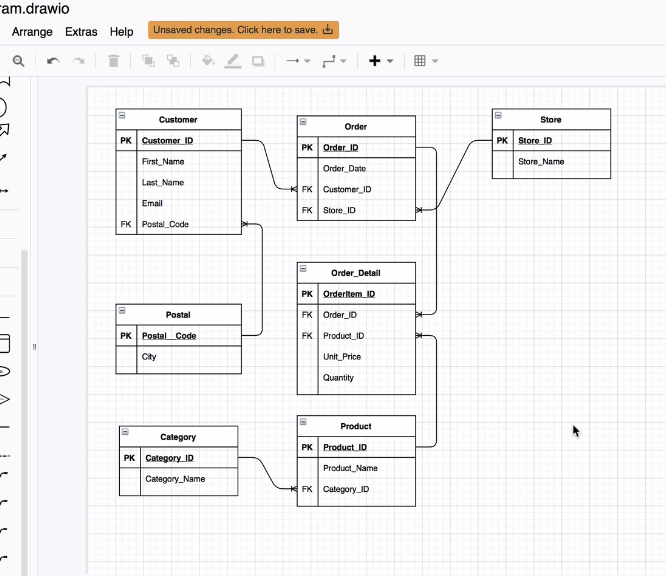

Due to reporting, we need data warehouse with fast reads and complex queries. Dimensional model and DWH are used. thats why we transform 3nf to dimensional model. We first need to identiy business objective: in our example, we're trying to identify products purchased from a single store by a customer. Then we identify granularity.

**granularity**: 
- lowest level of information stored in the fact table.
- if the table contains daily sales data, then the granularity is daily.
- in our example, a store sales multiple products to customers daily. So, granularity is made up of a combo of day, customer, product store since we're looking at orders purchased at a store every day. 
- granularity could result too much data. Too high granularity means users won't have enough detail.

#### Dimension table from 3nf
- remember dimension tables are denormalized.
- we will combine tables if they belong to the same business entity. So we denormalize. We might combine postal code and customer because postcode tells us where the customer lives.
- we can integrate when the attributes are in the same logical business entity or if they are attributes with strong relationship (like 1 to many) or if they are attributes in same hierarchy (producdt and product group). That's why we integrate here. Product and Category are good candidates for integrating into denormalized table.
- we could use Snowflake schema if we want to keep those kinds of tables separate
- fact table holds keys to dimension tables and some attribute that is _measurable_.

- if a customer chagnes cities, we can use slowly changing dimension tables. we can add a start_time and end_time to customer table to show that a customer moved cities and lived there between certain dates.

- 1 to many relationship. A dimension can have many facts. A non-unique order can have teh same dimensions and be a different row in the fact table is the intuition behind why the relationship is 1 dimension to many fact tables.

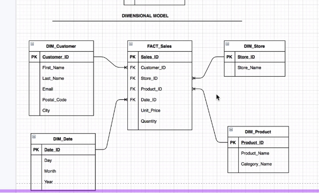

## Data Vault Introduction

- DWH are a critical role for companies to analyze data to derive accurate business insights and forecasting.
- Two DWH designs are kimball and Inmon method.
- Star Schema is widely used DWH solution (Kimball).
- Data Vault was released later and is new from year 2000.

DWH traditional solutions have problems:

**3NF problems**:
- parent-child complexities. if parent changes, child often changes.
- cascadiing change impact
- changes involve significant construction effort.

**Dimension model**:
- granularity of fact table takes time. or a new fact table. Changes in granularity is tricky.

**Data Vault**
- entire methodology for data warehouse projects

Hub, Link, and Satallite tables are what compose data vault

**Hub** - represents business cases that are uniquely identified with low tendency to change. represents core business concepts like vendors or customers or sale or product.
**Link** - relationship btw hubs and sometimes other links. it includes the unique combo of **business keys**
**Satellite** - includes descriptive historical attributes of hub and link tables and consists of data that tends to change over time

what is a business key? Independent from natural systems and is also called a natural key. something used to identify and track information. Business key is not equal to PK all the time. It's a natural key used to uniquely identify (like a customer code or product sku)

**advantages**:
- data vault is meant to address flexibility scalability issues in other data model approaches. meant to be auditable historical data of enterprise applications.
- is flexible enough to change with changing needs of business over time
- supports incremental delivery. models can be extended without changing existing structure.
- changes do not affect other tables... so it can flexibly change
- manages history well
- can work with structured and unstrutured data
- integrates with big data tools

**some drawbacks**:
- number of tables is high because normalized. separate businesses and attributes and source tables out. more tables than denormalized structure
- more storage space
- not worth implementing if data is straightforward and if dimensional model is better suited.

#### Hub Table

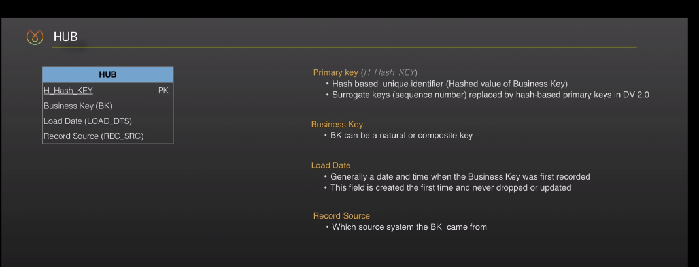
- load date and record source never change
- Hub Entity must never contain foreign keys
- Hubs stand alone (be a parent to all other tables)
- business key and primary keys never change
- hubs can store hash keys and they can be a combination of business keys

#### Link Tables
- link tables join hubs to other hubs
- represents relationships, transactions, and hierarchies between them
- the hash keys of the hub tables are used as foreign keys in the link table. do not use the business key itself but hash keys. see diagram below:
- note the hash key in the link table is the hash of the Hub's business keys, not hash keys.
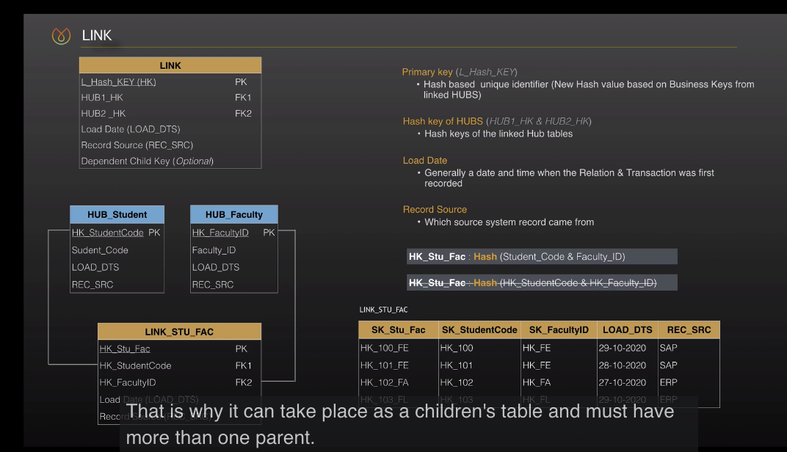
  
- each link table stores hashkey columns from the Hub tables AND creates own hash key based on business fields from relevant hubs. The hash key that it creates from the business keys (not the hashed business keys) is the primary key.

There's a relation between student and faculty.

This is 3nf bridge compared to link tables:
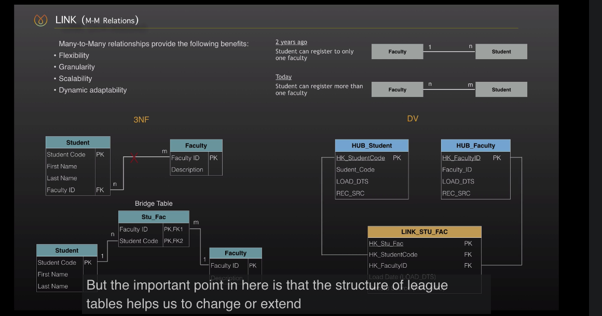

Bridge tables in 3nf are similar to Link Tables. Both are many-to-many relationships. Both contain primary key or hash key from parent table.
- why use many-to-many in link tables? if ruels change from one-to-many to many-to-many, it doesn't impact datasets. Link tables are many-to-many by default which helps with changing business processes. Requires less reengineering effort in a short period of time.
- link tables are always many to many by default and is more resilient to business changes that go from 1-to-many to many-to-many

#### Satellite tables
- provide descriptive of hubs and link tables.
- primary purpose is to track the history by cpaturing all changes to data.
- can be attached to hub or link table.
- only 1 parent table
- satellite is not parent to another table
- satellite does not have own hash key. the hash key fiel contains hash key of parent table.
- records are unique by hashkey and loaddate because hash key is repeated when data in satellite table is updated.
- contain descriptive information about the business key
- you can separate out satelite tables by rate of change. Say address and name are on employee table in the 3nd model. Address changes faster than name, so split address and name into separate satelite tables.
- so since satellite tables capture history, the primary key from the parent Hub table may not be unique so primary key is both the hash key from the parent table AND the load_date timestamp.
- a satellite table when linked to a Link table captures relationship changes (when a student changes a class or something).

## How to split source records to DV tables example

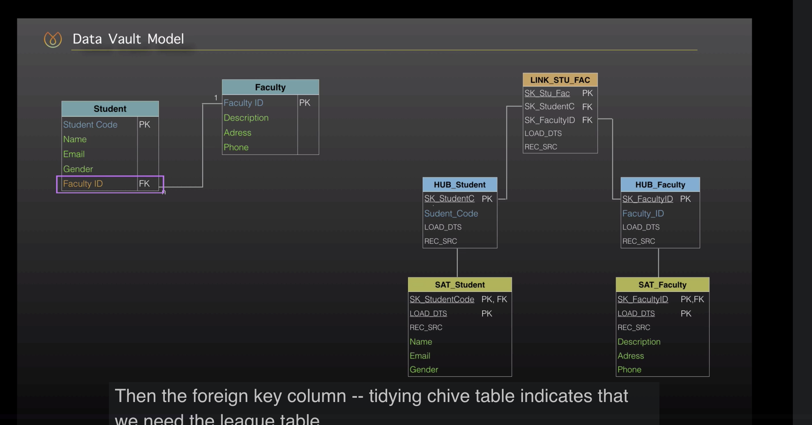

#### Insert scenario:

we have student and faculty (majors pretty much). Let's see what happens.

say a student registers for a faculty, so what DV will be impacted?
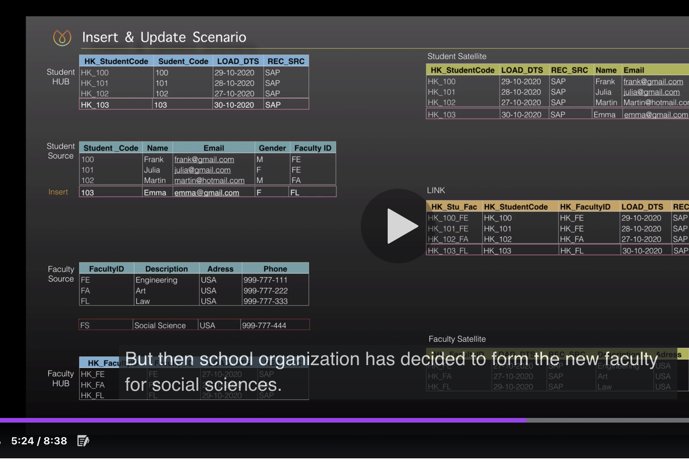

explanation of above diagram:
new student in 3nf table so...:
new record in student HUB table
new record in satellite table because we need the attributes
new link because new relationship between teh new student and the faculty.
no insert in faculty because the faculty law existed already

#### Update scenario
say a student updates his email, so what DV will be impacted?
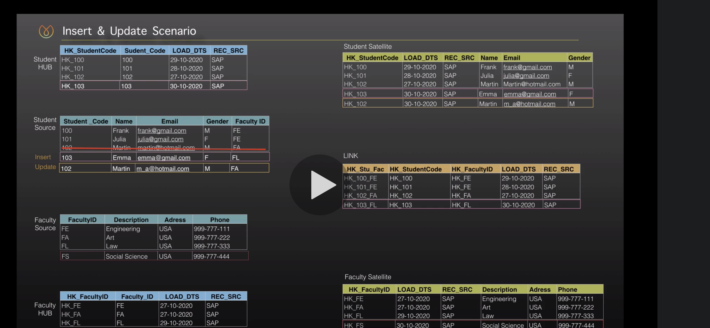

- we don't need to update or insert into student hub because martin is already there. We don't even touch load_date because that's teh first time the table sees the information.
- link table btw student and faculty does not change because martin does not change his faculty
- new record in satellite table is created.

## Link detail further explained

This is our example:

This is the 3nf

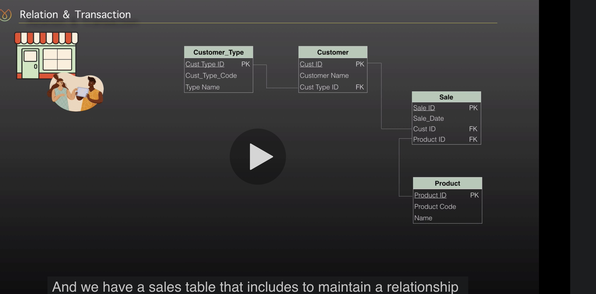

Types of link tables:
- relational/standard - just shows relationship between two hubs using foreign keys and has its own primary key which is a hash of the two business keys from the parent table. foreign key and private key relationship
- hierarchical - ? (we do this at Hinge)
- transactional (less used because HUB tables for sales or events is more intuitive)

#### Non historized link = transactional link
- if the same record shows up same day (same ice cream sale by the same person to the same customer on the same day), the data vault may not record the transaction. Why wouldn't satellite store? they only store history when there is an update to the record. But for new records with the same details and characteristics... it won't get recorded.

- we can record unique sales using an id from the source table. It could be a composite attribute. So a unique sales_id will help make the above scenario unique.

#### Another way to model transactions
- model it as a HUB instead of a LINK table. So sales would be a HUB table. So the sales ID would be in the HUB table that uniquely identifies a sale. Again, it could be a compositie key.

- aligned with standard data vault structure... this is an intuitive way to model transactions or events.
- if you use link table for transactions and relations, could be confusing.

#### Can you create links to other links?
- no, don't do that.

- it introduces to link tables to parent link table. does not perform well in high-volume situations and implement links independently.
- just combine links to lowest granulartiy possible.

#### Flexibility and Granularity of Link
- link tables capture past present and future relationships between entities.
- links do not keep start or end date or timelines
- they keep a load date and that's it.
- links alwyas represent many to many relationships, which is flexibility as business rules changes. so you don't need to change the link tables.
- the cardinality by default is many to many.
- But there can be schema and granularity changes because business warehouse are living and breathing systems.

at first we have Student and Class tables in 3nf form. So look at the Data Vault structure on the right:

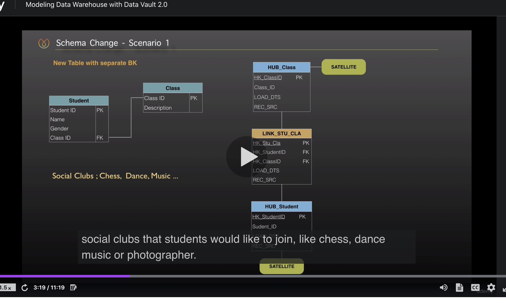

but later we want to add social clubs. So we add a Club table to 3nf.
- in 3nf, changes to parenet rippled through child relationships so if cardinality ot tables changes due to businesse changes, whole structures need to be changed.
- in DV, we add a Club Hub and a Link table connecting Student to Club. no Change to existing structure of DV unlike 3nf and dimnesion where we have to add a lot of stuff.

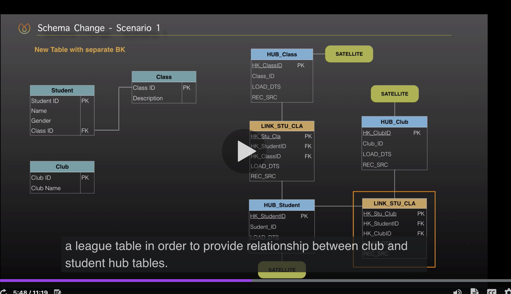

- Another scneario, we have student_address added: in DV if we want to track a new info like student_address but student_id already exists in the Student Hub, we can just add a satellite table for student_address. don't even need a link table. If the buseiness key exists in the Hub, we just add a satellite table.
- another scenario: source system adds email. We can add the attribute to the satellite if the satellite is small.  or a new satellite table for email. Data model is not impacted and we can just add a new table.

- what if we change granularity. Granularity is number of Hubs in DV model. So what if we add grades as a concept:
  
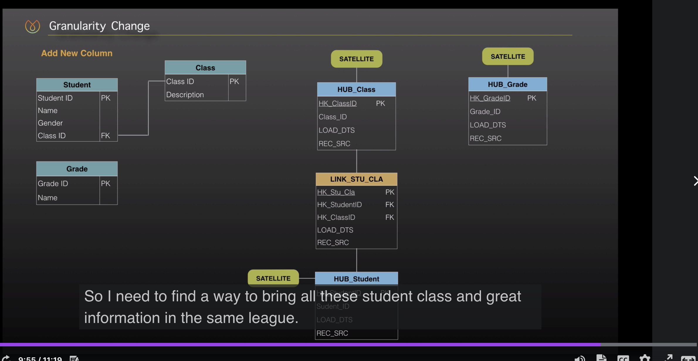
- we combine the old and new link data into a new table and close the old link. closing link means no new data is added to old link.

- we extend models without affecting existing structures in DV when we change the model

#### Same as link

- form of recursive relationship that two records in hub table are the same core concept. customer ids in two systems have differnet ids but same customer for example.

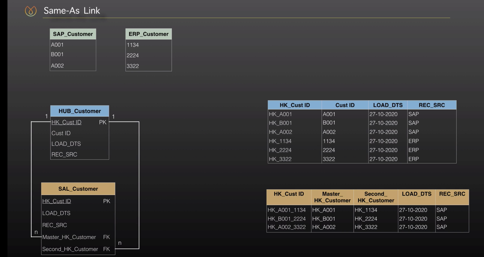

#### Hierarchical
- used to capture relationships between entites in same hub table.
- ex: employee and manager.

you could create hubs for different levels OR use hierachical link. Everything is in the same HUB because managers are also employees.

- hierarhical link is recurisve link to express that there is a parent-child relationship in samee HUB.

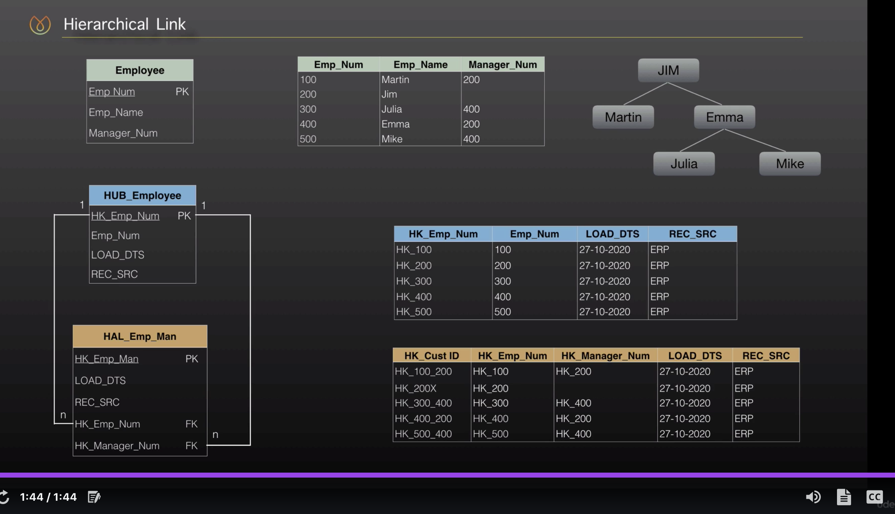

## Satellite detail

- Load_end_date is a column that stores information is valid until a new record appears.
- this is the only column taht is updated but that will slow down the system to do updates. so we dont typically want to use load_end_date. adding and update data is too costly and slow

#### multi active sattlite

- can have multiple active records for same business key
- an example is a satellite that stores a customer's mutliple addresses and credit cards.
- we had a sequence number to identify uniquely the multiple values for a single customer.

look at sample, credit card number is an attribute. we have a sequence number to uniquely identify the card numbers:

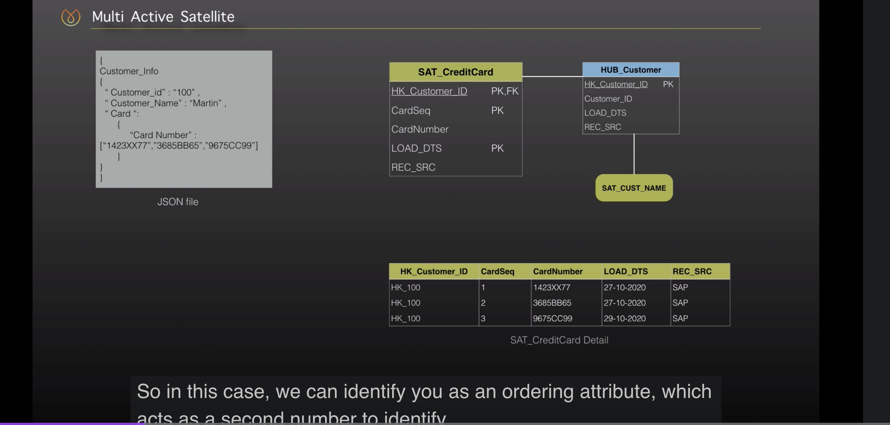

- card numbers and cusotmer name is split into different satelites because we don't want redundant information
- so the satellite for card has a sequence number to identiy different card numbers for same customer.

#### Status tracking sattlite

- used to keep the data from CDC - stores adds, updates, deletes from source system whenever a user causes one of these operations.
- it's  satelitte table that keeps track of product status in this example:

simply keeps track of cdc operations:

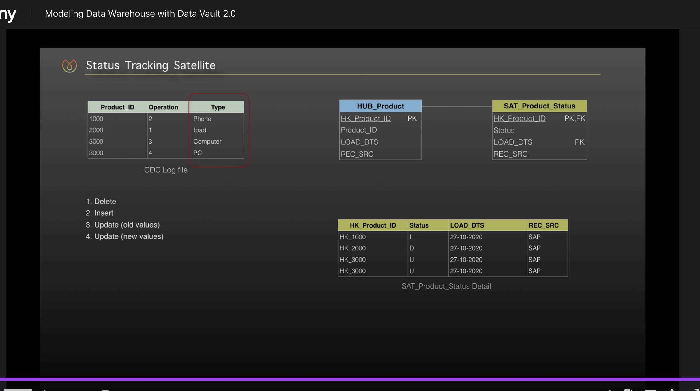

#### Record Tracking satellite
- tracking systems that checks if the relevant key exists in source system or not. 
- if we don't have CDC systems and so it's hard to identify missing records or deleted records
- so we keep a satellite table of a HUB that says if the record was present in the source system or deleted.
- it has a timestamp when record was last seen in source system. Source system is extracted from SAP. Number of 1 means it was present as seen below:

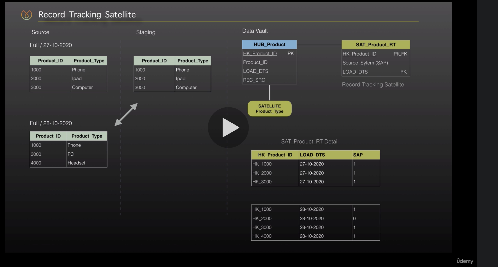

so when new full load data comes in on the left, we compare it to the staging area and create a new record-tracking satellite. Since 2000 is missing, we put a 0 in SAP to indicate that it's missing with the load_date

#### Effectivity Satellite and Driving Key

- so in this scenario, the link table may violate the business rules. Say there is a business rule that states that an employee cannot be part of more than 1 department... but if an employee moves he ends the relationship with the previous department. But the Link table does not have an end_date or convey this info. so the link table will contain two relatinoships (say a student in 2 different majors or an employee in 2 different departments) which violates the businesss roles See diagram.

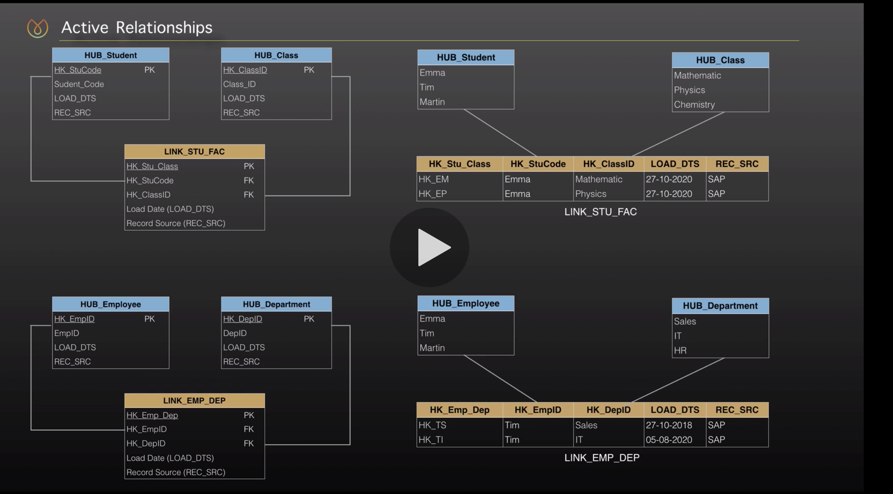

so to solve this problem we create **effectivity satellites** which is connected to link tables to track that a previous relationship is ended. They track time period of the relationship. These effectivity satellites record the time period when relationship has started and ended.

The primary key is the same hashkey from the link table. and then it contains effective_from and effective_to columns to track the relationship effectivity.  you can leave effective_to as empty or like at year 9999 when the data first loads to express that it's active.

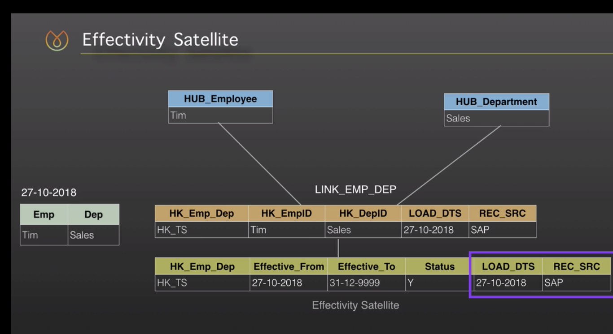

the dates come from the source system. we do not make them up.

Example:
this is the standard link satellite where the link satellite records changes:

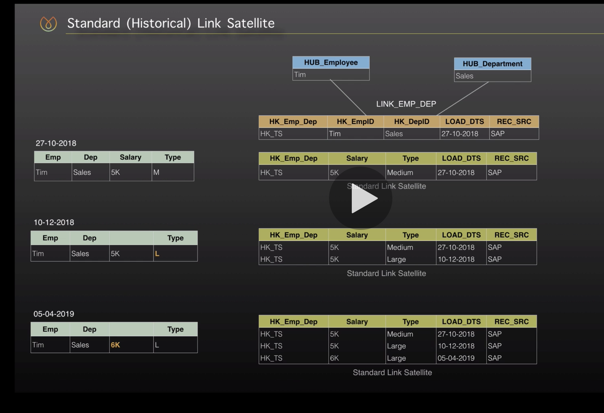
- no changes to link table.
- remember no updates to satellite table. all updates are inserts in the satellite table.

Here's how we'd use effectiviy sattelites:
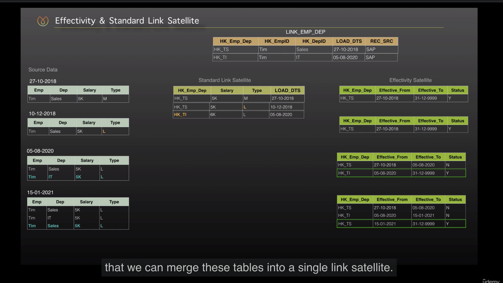

- when tim has a salary or package type change, those changes are done in the standard link satellite but not in the effectivity satellite.
- department changes are done in the effectivity satellite and the link table AND the standard link table because a new hash key between the employee and department needs to be created (new relationship).
- notice when tim joins a new department (IT), there's a new link table record, a new satellite record, and a new effectivity record (to say that the relationship for sales and tim is old and the new relationship with IT is effective and current).
- notice employee_id is the **driving** key because it does not change and the changes are around the employee. We're recording changes to teh employee relationship and the emp_id stays constant so it's the driving key. The driving key is the PK of the child table, the table that has the foreign key because it's the one that is changing. Here the employee is the child table because the employee belongs to a department.
- when an employee changes departments and comes back at different times, that info isn't in the standard satellite (only captures characteristics of the relationship), and the link table doesn't show this either... the link only shows the relationship but doesn't show when the relationship was effective. that's what the effectivity is for.

# Data Vault Architecture

Notice the data vault is composed of the raw vault and business vault:

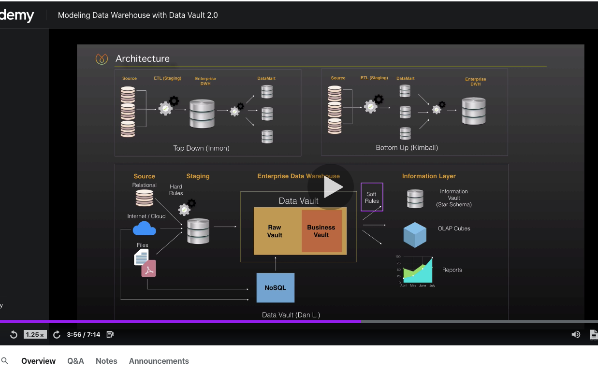

- hard rules do not changes format of data or meaning. converstion of data type but not meaning of data. They change the way of data is stored. Maybe truncation of data and is used when data is extracted from source system.
- soft rules transform data into different formats. They change the data or meaning of the data. They aggregate data or separate data or transform format of the data. It's for end user.
- so data warehouse stores in granularity provided by source system because only hard rules are applied.
- the data warehouse can have the data vault and stores all time-variant data.
- raw vault: the hub-link-satellite structure and is used by sql power users who knows the data relationships. a lot of users should not use this layer of the architecture, they should use the next information vault.
- business vault: pit (point in time)-bridge-reference structure. This is optional.
- information layer: for end user and can be dimension and fact tables and in star schema. easy data access.

**data vault is only really accessed by power users who know joins and advanced sql**

# Business Vault

#### Point in time tables
- it's a specialized type of satellite that helps with query performance from a hub with multiple satellites.
- make query out of data vault easier and to increase the query performance is the main point.
- remember a Hub can have multiple satellites. Why? Different rate of changes of the data. Maybe one attribute changes faster than another so we separate the attributes out to different satellite tables. For ex, a customer phone number changes faster than her name. We don't want to load an entire row into single big satellite table each time her phone changes. Query performance is better if fewer row in the smaller satellite tables.
- if an end user (data science) asks what a customers phone number was in a specific point in time, these point in time tables help with that question. Satellites normally have different load dates so that query could get tricky if the Hub table has multiple load dates such as below:

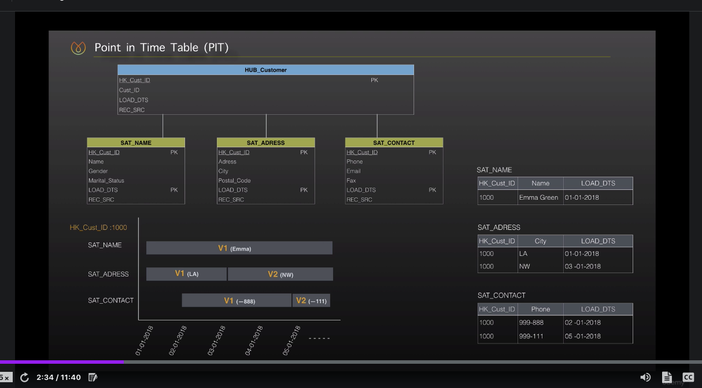

- they store max load_date of each attribute from each of the satellites.
- we need to create a new PIT table record every day.

This is how we would query a PIT table:

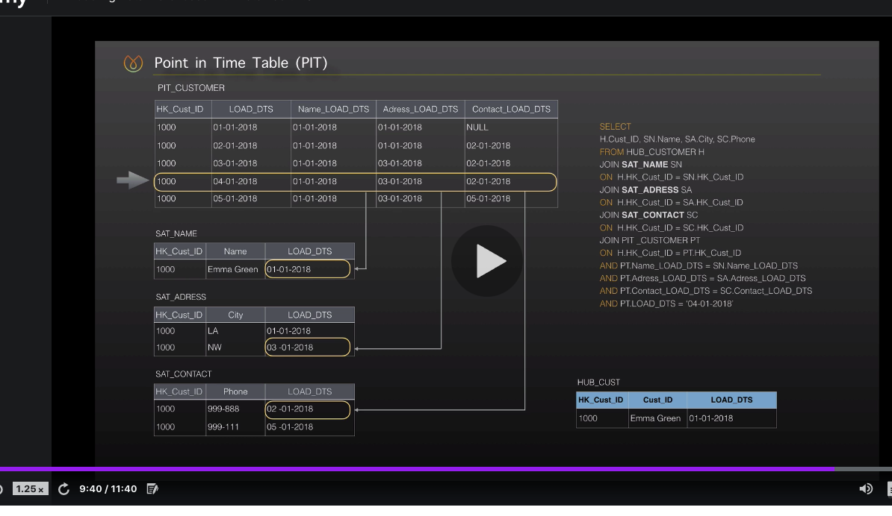

In the above, we use the PIT table to get the latest up to date attribute in each satellite table when the HUB has multiple satellite tables.

#### Bridge Tables

- improves performance by reducing number of joins needed for a query.

If we need which employees, their department, and their roles. we can do that given the structure below, but there are multiople Hubs and Links between Satellites and so we need a lot of joins to bring the data together. As the number of Sql joins goes up, performance decreases. In this join query, we needed to traverse the entire graph of Hubs, Links, and Satellites to get the data we need in the Select statement.

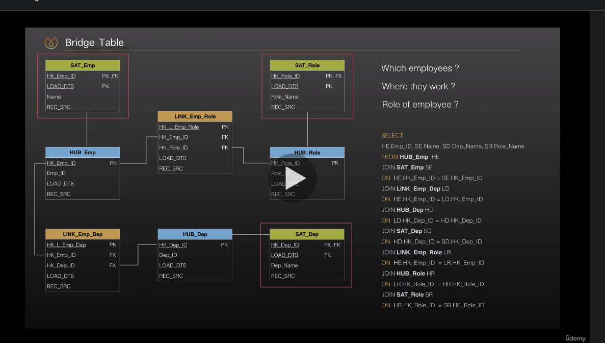

- as you can see below, the bridge table contains all of the hash keys from Hubs and Links so the subsequent join is a lot fewer. Only needs to join to the satellite tables for the descriptive data. This will eliminate joins and increase performance. With bridge tables, you no longer need to join with Hubs and Links since the Bridge has all the hash key info. We just need to join to the satellite tables.

the bridge table seems to be a combined table of employee, department, and role, the bridge table has all that info. includes all info so you don't need to pass through and join all the tables.

#### Reference Table
- not main component in data vault but used. It is common to introduce additional descriptive information that isn't provided by the operational data systems. They contain descriptive information that do not change and are used to describe the business keys. Connected to satellite table. Since they do not refer to an entity, they are not stored in the Hub table. 
- Reference are lookup tables are used to store reference codes that can describe keys in Hub tables. But we do not put them in satellite table since they are often repeated.
- In the example below, the `code` column is the foreign key and primary key of reference table. The code is something like phone or mouse. But the reference stores data like description of the mouse or phone.

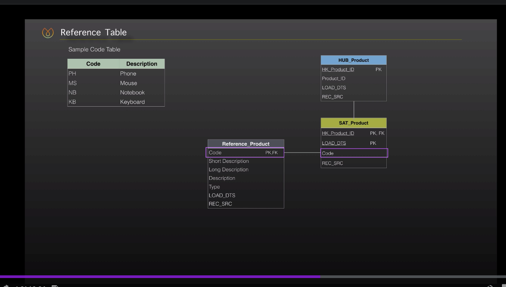

# Information Vault

- contains fact and dimension tables.
- why do we need this? Data vault is not optimized for query performance and if used, users need advanced SQL skills in order to get results out of raw or business vault. Not compatible with a lot of BI tables
- The information Vault is like data mart for regular data warehouse approaches but the key is that you need to form dimension and fact tables out of Hub, Sat, and Link tables.
- **Hub and Sat can be Dimensions, Link and Sat tables can be Fact Tables.** This is how to create a Star Schema out of Data Vault model. You can just build the Information Vault using Views so we don't need to care about the data loading process for an additional layer.

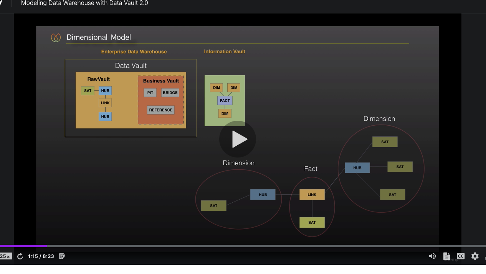

Two types of Dimension tables, here's a reminder
- Type 1 stores only current
- Type 2 stores historical

In the example below, Jim Black changes cust_type. Type 1 does not store the past and simply updates the cust_type, Type 2 does store the past by adding a new record

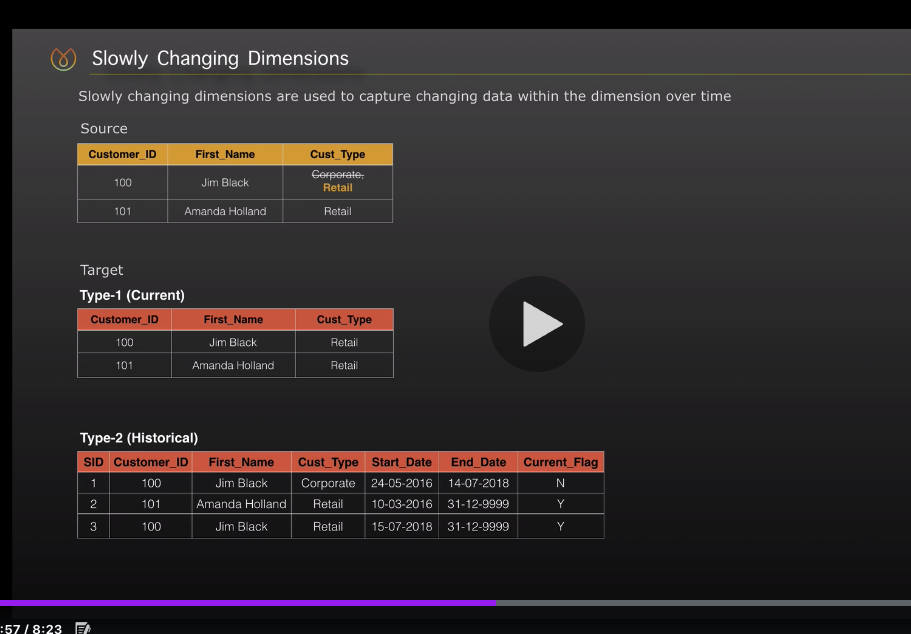

If the information is critical and needs to be saved, opt for Type 2 Dimension Table. Sometimes it's not necessary. Like phone number information... we don't need the history of phone numbers, just the latest. But customer type information might be type 2 since we want to see what customer types buy more. contact info could be type 1, customer categories can be type 2.

So what does history in satellite type look like?
- remembert we do not update satellite tables. We create new records.

The right side is the history in satellite. We can look for the latest

The left side is similar type 2 for cust_type data

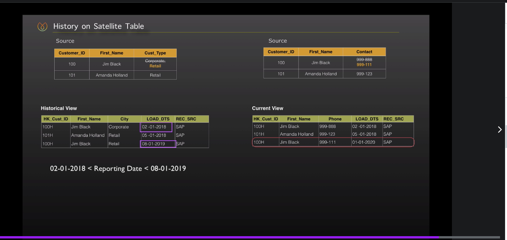

